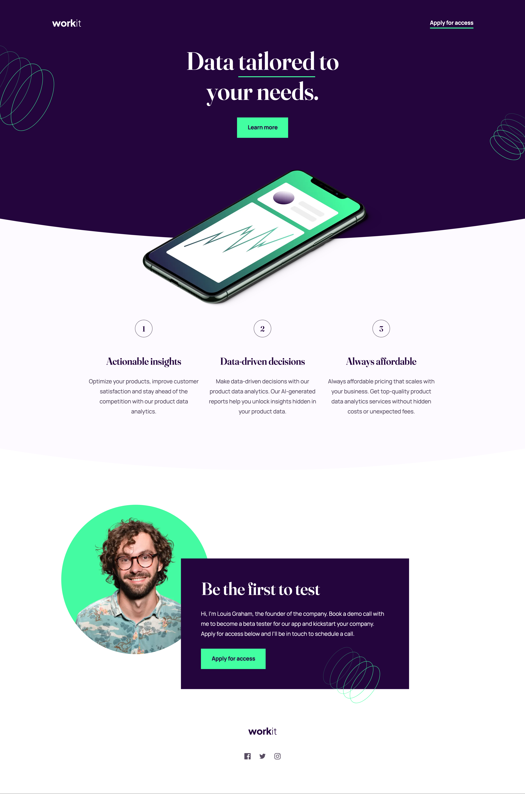
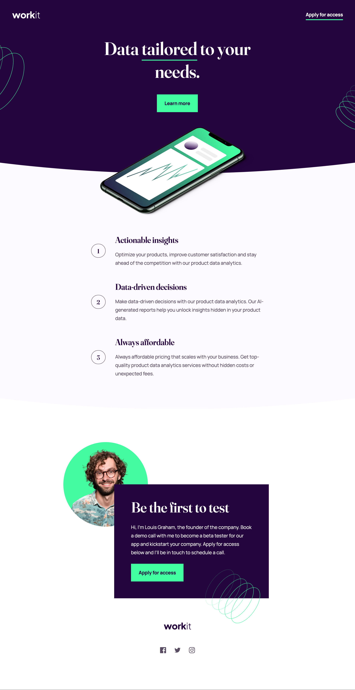

# Frontend Mentor - Workit landing page solution

This is a solution to the [Workit landing page challenge on Frontend Mentor](https://www.frontendmentor.io/challenges/workit-landing-page-2fYnyle5lu). Frontend Mentor challenges help you improve your coding skills by building realistic projects.

## Table of contents

- [Overview](#overview)
  - [The challenge](#the-challenge)
  - [Screenshots](#screenshots)
    - [1. Desktop version](#1-desktop-version)
    - [2. Tablet version](#2-tablet-version)
    - [3. Mobile version](#3-mobile-version)
  - [PageSpeed Insights results](#pagespeed-insights-results)
  - [Links](#links)
- [My process](#my-process)
  - [Built with](#built-with)
  - [Tested with](#tested-with)
  - [What I learned](#what-i-learned)
  - [Useful resources](#useful-resources)
- [Author](#author)
- [Acknowledgments](#acknowledgments)

## Overview

### The challenge

Users should be able to:

- View the optimal layout for the interface depending on their device's screen size
- See hover and focus states for all interactive elements on the page

### Screenshots

##### 1. Desktop version



##### 2. Tablet version



##### 3. Mobile version


### PageSpeed Insights results

[Mobile version](https://pagespeed.web.dev/analysis/https-workit-landing-page-rc-netlify-app/i41mnpkxgc?form_factor=mobile)

[Desktop version](https://pagespeed.web.dev/analysis/https-workit-landing-page-rc-netlify-app/i41mnpkxgc?form_factor=desktop)

### Links

- Solution URL: [Workit landing page github](https://github.com/rupali317/workit-landing-page)
- Live Site URL: [Workit landing page live](https://workit-landing-page-rc.netlify.app/)

## My process

### Built with

- Semantic HTML5 markup
- CSS custom properties
- Flexbox
- CSS Grid
- Mobile-first workflow
- [React](https://reactjs.org/) - JS library
- [Styled Components](https://styled-components.com/) - For styles
- [Netlify](https://www.netlify.com/) - A cloud platform that provides hosting services

### Tested with

- Browsers used for testing: Google Chrome, Firefox, Safari, Brave, Microsoft Edge.
- Devices:
  - (Real) MacBook Pro (15-inch), Samsung Galaxy A33 5G, Samsung Galaxy S20+, iPad Air 2, MacBook Pro (13-inch).
  - (Virtual) The mobile and tablet devices mentioned under Chrome's dev console.
- Screen reader: MacOS VoiceOver.

### What I learned

In the following code snippet, I have created an `<svg>` by defining the path with notations like moving a point, created the curve and drawing the lines. The `.curved-effect` class in my css uses the id defined in the `<svg>`. This ultimately helped create the curved section.

```html
<svg width="0" height="0" style="position: absolute">
  <defs>
    <clipPath id="clipped-path" clipPathUnits="objectBoundingBox">
      <path d="M 0 0.7 Q 0.5 1.3 1 0.7 L 1 1 L 0 1 Z"></path>
    </clipPath>
  </defs>
</svg>
```

```css
.curved-effect {
  width: 100%;
  height: 3.875rem; // 62px
  clip-path: url("#clipped-path");
  position: absolute;
  bottom: 0;
  right: 0;
  z-index: 1;
  transform: translateY(0.0625rem);
}
```

### Useful resources

- [Coding a curved carousel](https://www.instagram.com/reel/C4FshYLt8_c/?igsh=MWF2aXl0enVqMWd5YQ==) - This provided me inspiration on how to tackle the curved section for workit landing page challenge.
- [CSS color filter generator](https://angel-rs.github.io/css-color-filter-generator/) - This helped me to alter the color of the social media links on hover.
- [Stackoverflow: How to allow keyboard focus of links in firefox](https://stackoverflow.com/questions/11704828/how-to-allow-keyboard-focus-of-links-in-firefox) - I faced an issue where in my MacOS's Firefox, the focus was not working as expected. There are some configurations that need to be done for the focus to work.

## Author

- Website - [Rupali Roy Choudhury](https://www.linkedin.com/in/rupali-rc/)
- Frontend Mentor - [@rupali317](https://www.frontendmentor.io/profile/rupali317)

## Acknowledgments

- I thank Grace Snow for providing insights on how to improve the accessibility.
- I express my gratitude towards my mentor - Deborah for the insightful code review session.
